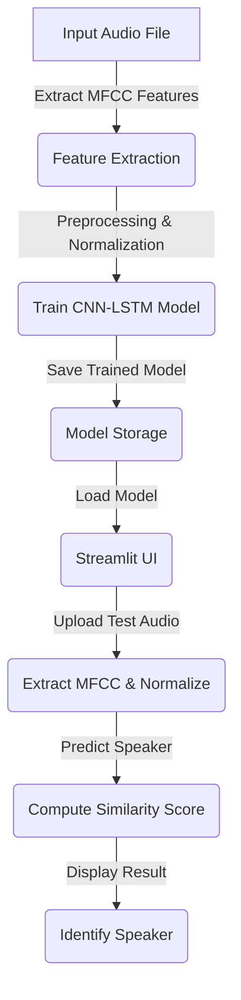

# 🎤 Speaker Verification System using Deep Learning
---
## 📌 Overview  
This project presents a robust **Speaker Verification System** that leverages MFCC-based feature extraction, a hybrid CNN-LSTM deep learning model, and an intuitive Streamlit interface for real-time interaction. The system is designed to authenticate and verify speakers by analyzing their unique vocal signatures, accurately determining whether a given audio sample matches a previously enrolled speaker.

---

## 🔥 Features  
 **MFCC Feature Extraction:** Captures relevant acoustic features from raw audio data to represent speaker-specific characteristics.  
 **Train a CNN-LSTM model:** Utilizes a hybrid Convolutional Neural Network and Long Short-Term Memory architecture for robust speaker classification.  
 **Performance Evaluation:** Assesses model accuracy and F1-score to ensure generalization and reliability on unseen audio samples. 
 **Streamlit-based UI:** Provides an interactive and user-friendly UI for real-time speaker verification and testing. 
 **Similarity score-based speaker identification:** Implements cosine similarity to match new voice samples against known speaker embeddings.
---

## 🫠 Technologies Used  
- **Python**   
- **TensorFlow/Keras** 🔬  
- **Librosa** 🎵  
- **Streamlit** 🖥️  
- **Scikit-Learn** 📊  
- **Matplotlib** 📈  

---

## 💂️ Project Structure  
```bash
📺 Speaker-Classification
├── 📁 dataset                        # Dataset folder containing audio samples
├── 📁 models                         # Trained models (saved as .h5 files)
├── 📁 streamlit_app                   # Streamlit UI implementation
├── 📝 README.md                      # Project documentation
├── 📄 train.py                        # Model training script
├── 📄 predict.py                      # Speaker prediction script
├── 📄 app.py                          # Streamlit application
└── 📄 requirements.txt                # Required dependencies
```

---

## 📌 Workflow  
Below is a **flowchart** explaining the speaker classification workflow:



---

## 🔧 Installation  

###  1. Clone the Repository  
```bash
git clone https://github.com/Alok-16Rajput/speaker_verification_system.git
cd speaker-verification
```

### 2. Install Dependencies  
```bash
pip install -r requirements.txt
```

### 3. Run Model Training  
```bash
Deep_Learning_Model_Code.ipynb
```

### 4. Start Streamlit App  
```bash
streamlit run app.py
```

---

## 🎯 Model Architecture Overview  
The proposed deep learning model is designed to effectively learn both spatial and temporal patterns in audio data for speaker verification. It includes the following key components:  
- **🔹1D Convolutional Layers** for Extracting high-level spatial features from MFCC representations of audio signals.
- **🔹BatchNormalization & MaxPooling** Normalize activations and reduce feature dimensionality to enhance learning stability and efficiency.  
- **🔹LSTM Layers** to capture time-series dependencies  
- **🔹Fully Connected (Dense) Layers**  Integrate learned features and apply Softmax activation to perform multi-class speaker classification.

---

## 🎼 MFCC Feature Visualization  

The **Mel-Frequency Cepstral Coefficients (MFCCs)** are extracted from audio signals to capture essential spectral features for speaker verification. The above heatmap visualizes the MFCC features of a speech sample.

### 🔹 Key Aspects:  
- **X-axis (Time):** Represents the duration of the audio signal in seconds.  
- **Y-axis (MFCC Coefficients):** Different MFCC values representing the frequency characteristics of speech.  
- **Color Intensity:** The heatmap colors indicate energy levels in **decibels (dB)**:  
  - **Red shades** → Higher energy levels  
  - **Blue shades** → Lower energy levels  

### 🎧 Why Use MFCC for Speaker Verification? 
Mel-Frequency Cepstral Coefficients (MFCCs) are widely adopted in speech processing because they closely mimic the human ear’s sensitivity to different frequency ranges. By emphasizing perceptually significant spectral features, MFCCs effectively capture speaker-specific vocal traits—making them particularly well-suited for speaker classification and verification tasks.

---

## 🚀 Future Scope and Enhancements
- **⚡Real-time Deployment:** Optimize model performance and latency to support instant speaker verification in live environments. 
- **🌐Multi-Language Support:** Extend the dataset to include diverse languages and regional accents to improve generalization across global users  
- **🔇Noise Robustness:** Integrate advanced noise reduction and speech enhancement techniques for reliable verification in challenging acoustic environments.
- **📱Edge Computing Compatibility:** Adapt the model for lightweight deployment on edge devices such as Raspberry Pi, smartphones, and IoT modules for offline authentication.
- **🗣️ Voice Assistant Integration:** Seamlessly incorporate speaker verification into smart assistants and home security systems for enhanced personalization and security.  
- **🔐 Federated Learning Integration:** Implement federated learning to enable privacy-preserving model training on distributed user data.
- **🧬GANs for Data Augmentation:** Leverage Generative Adversarial Networks (GANs) to synthetically generate diverse speaker samples and enrich training datasets.

---

## 📞 Contact  
📧 **Email:** alok1602.kumar@gmail.com  

